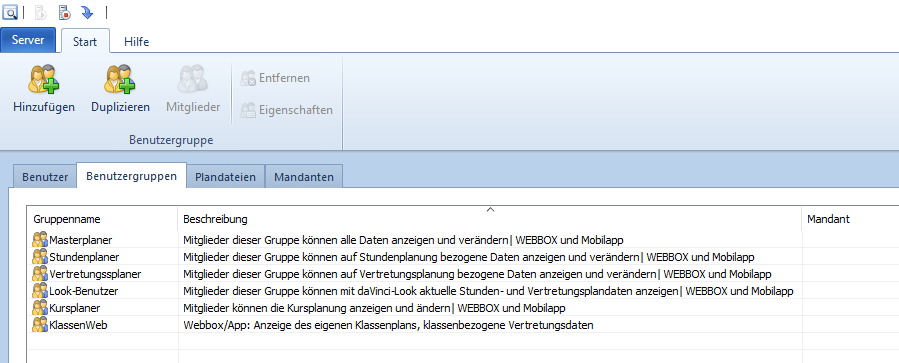
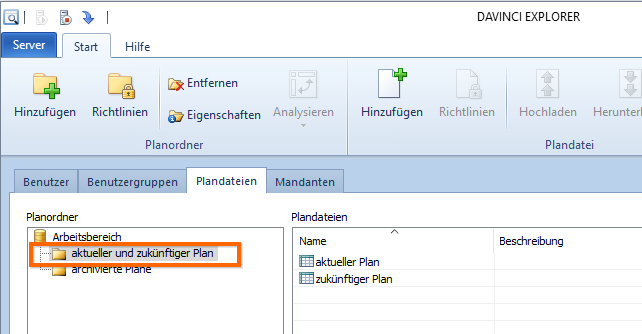
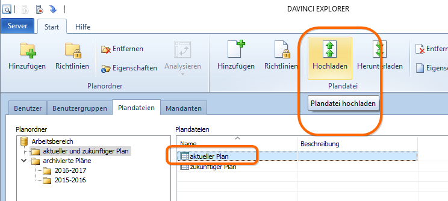
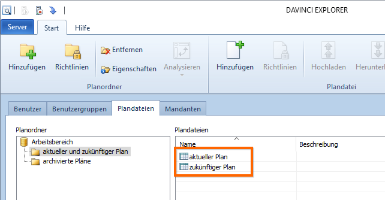
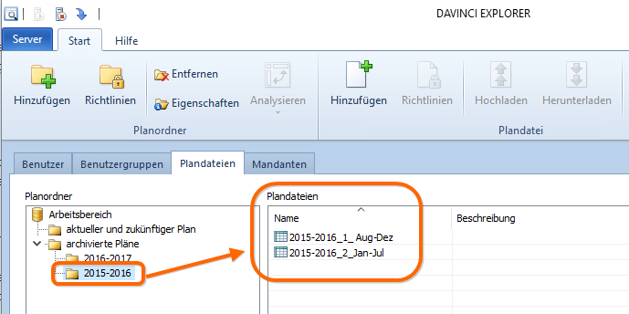
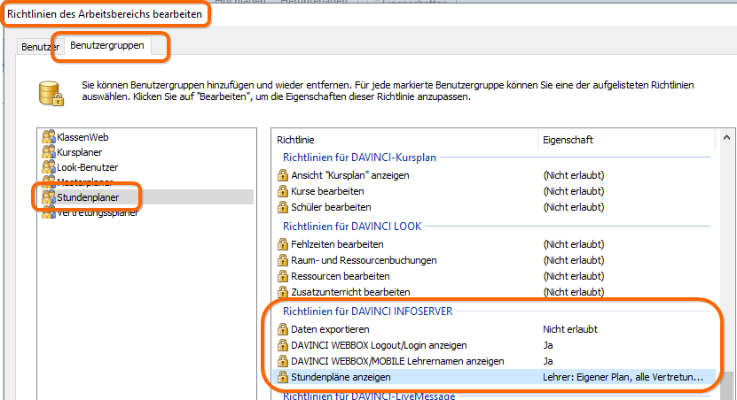
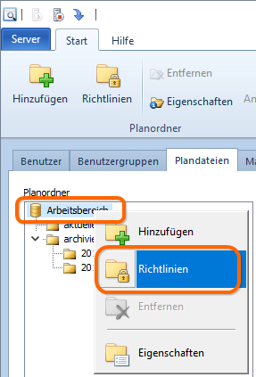
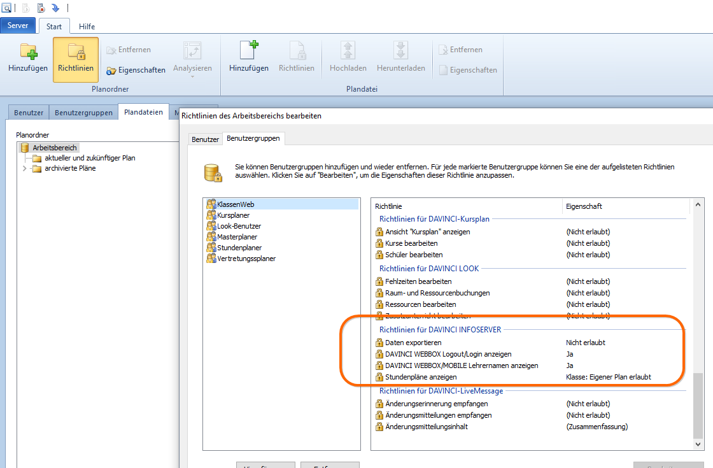

# Plandateienstruktur und Rechtevergabe

In diesem Artikel möchten wir Ihnen Anregungen und Tipps geben, wie Sie geschickt Ihre Plandateienstruktur anlegen und Benutzerrechte zuweisen. Ziel ist, beim Planwechsel nach möglichst wenigen Schritten fertig zu sein!

Wie beschreiben eine allgemeingehaltene Verzeichnis- und Platzhalterstruktur, an die möglichst per Benutzergruppe die Richtlinien geknüpft werden.

## Vorüberlegungen

### Welche Rollen gibt es

Welche Rollen hinsichtlich der Stundenplanung, der Vertretungsplanung, der Kursplanung, des Zugriffs auf die WEBBOX/auf die App .... gibt es an Ihrer Schule?

**Jeder Kollege soll letztlich nur in einer einzigen Benutzergruppe enthalten sein**, insofern muss als erstes definiert werden, welche Benutzergruppen Sie benötigen.

Beispiel:

Kollege1 soll Zugriff auf die Stundenplanung, die Vertretungsplanung, auf LOOK haben und soll seine Plandaten auch über die WEBBOX oder die DAVINCI Mobile App sehen können. Kollege2 soll zusätzlich noch den Kursplan editieren können, damit können beide nicht in einer Benutzergruppe sein, Sie müssen bitte für dieses Beispiel zwei Benutzergruppen anlegen.

### Welche Dateien möchte ich über den DAVINCI Server verwalten

Man kann im DAVINCI Explorer einen Benutzer oder eine Benutzergruppe auf verschiedenen Ebenen Rechte/Richtlinien zuordnen:

|Nr.|Rechteebenen|
|:--|:--|
|1.|**auf Ebene des Arbeitsbereichs** <br/>(damit auf alle drunterliegenden Ebenen)|
|2.|**auf Ebene eines (oder mehrerer) Verzeichnisse** <br/>(damit auf alles innerhalb des Verzeichnisses)|
|3.|d**irekt einem oder mehreren Platzhaltern** <br/>(damit gezielt einer Plandatei)|

Als erstes müssten Sie bitte für Ihre Situation folgende Punkte klären:

1. Welche Typen von Benutzern DAVINCI-Nutzern gibt es an Ihrer Schule?
2. Welche Plandateien sollen über den Server verwaltet werden?

## Benutzergruppen

Im DAVINCI Explorer kann man Benutzergruppen anlegen, die erst einmal nur eine Sammlung von Benutzern sind. Die vorbereiteten Benutzergruppen kann man später einer oder mehreren Ebenen (Arbeitsbereich (die dort gewährten Rechte gelten für alle über den Server verwalteten Dateien), Verzeichnisse (allen darunter befindlichen Dateien), Platzhalter(einer einzelnen Plandatei) zuordnen und mit Rechten versehen.

Hinsichtlich der DAVINCI-Nutzung gibt es meist Masterplaner (zum Beispiel für die Schulleitung, die auf alle Bereiche zugreifen können soll) Look-Nutzer, Stundenplaner, Stunden- und Vertretungsplaner, Kursplaner und vielleicht auch Kombination? Bitte überlegen Sie sich, wie viele unterschiedliche Rollen es an Ihrer Schule gibt. 

>#### warning::Wichtig!
>
> In einer Benutzergruppe werden Nutzer zusammengefasst, die identische Rechte erhalten.

Beispiel:
Sie haben Kollegen, die Stundenplaner, Vertretungsplaner und Looknutzer sind. Einer dieser Kollegen bereitet aber zusätzlich noch Kursplanung vor. Dann benötigen Sie für dieses Beispiel zwei Benutzergruppen.
Benutzergruppe1: Stundenplaner, Vertretungsplaner, Appnutzer und Looknutzer
Benutzergruppe2: Stundenplaner, Vertretungsplaner, Appnutzer, Looknutzer und Kursplaner

>#### warning::Wichtig!
>
> Jeder Kollege soll nur in einer einzigen Benutzergruppe enthalten sein.
>
> Die im Explorer angezeigten Benutzergruppen sind lediglich Vorschläge, bitte passen Sie die Bezeichnung und Beschreibung der Benutzergruppen an.



## Verzeichnisse anlegen

Ganz grob gibt es die aktuelle Plandatei ("aktueller Plan"), vermutlich auch eine Plandatei, in der der nächste Zeitabschnitt vorbereitet wird ("zukünftiger Plan") und es gibt Plandateien, die zu archivieren sind.

Wir empfehlen Ihnen als erstes unterhalb des Arbeitsbereiches zwei neue Verzeichnisse anzulegen, eins für die aktuelle und zukünftige Plandatei und ein zweites Verzeichnis, das als Archiv dient.



Unterhalb des Archivverzeichnisses legen Sie pro Schuljahr weitere Unterordner an.


## Platzhalter

Der DAVINCI ENTERPRISE Server verwaltet selbständig alle Plandateien in einem Verzeichnis auf Ihrem Server. Die dort abgelegten Dateien werden mit einer eindeutigen Zeichenfolge gekennzeichnet, der GUID. Diese eigentliche Plandatei ist mit dem im DAVINCI Explorer angelegten Platzhalter (zum Beispiel "aktueller Plan" oder "zukünftiger Plan") verknüpft.
Legen Sie einen Platzhalter an, geht vor dem Speichern ein Fenster auf, es soll auf eine Plandatei verwiesen werden, eine Kopie dieser Datei wird im Server-Verzeichnis abgelegt und mit der eindeutigen Zeichenfolge benannt. Lädt man später eine neue Datei auf den Platzhalter hoch, wird der Inhalt der ersten Datei überschrieben, die Dateibenennung bleibt aber erhalten, genau diesen Effekt nutzen Sie fürs neue Schuljahr.



> #### danger::Achtung!
>
> Es ist wichtig, dass Sie bitte nie direkt im Verzeichnis Arbeitsbereich des DAVINCI Enterprise Servers (Pfad im DAVINCI Server Control in der Systemsteuerung des Serverrechners) arbeiten, sondern bitte alle strukturellen oder Änderungen der Richtlinien über die Oberfläche des DAVINCI Explorers vornehmen.

### Verzeichnis "aktueller und zukünftiger Plan"

In der nachfolgenden Abbildung sehen Sie auf der rechten Seite die vorbereiteten Platzhalter für die jeweils aktuelle Datei und für die jeweils zukünftige Datei. Wichtig an Stelle ist, diese Platzhalter richten Sie einmalig ein und "hängen" Ihre Rechteverwaltung daran, daher auch die allgemein gehaltenen Bezeichnungen. Sie werden zukünftig nur die immer die jeweils aktuelle Datei auf den gleichnamigen Platzhalter laden, damit müssen Sie keine neuen Rechte zuweisen usw.



### Verzeichnis "archivierte Pläne"

Im Gegensatz zu den allgemeinen Benennungen der Platzhalter im vorstehenden Abschnitt, können Sie im Archivbereich die Platzhalter individuell nach dem Zeitabschnitt benennen. Der Unterschied hier hat mit den Zugriffsrechten zu tun:
Es genügt vermutlich direkt auf das Verzeichnis "archivierte Pläne" Rechte zu vergeben, für die hier zugreifenden Nutzer wird in der Regel kein Unterschied nach dem einzelnen Plan gemacht, sondern der Nutzer darf archivierte Pläne einsehen oder er darf es nicht.



## Rechtevergabe

In diesem Abschnitt soll es um eine überschneidungsfreie Rechtevergabe gehen. Beginnen wir mit den Rechten für die Webpublikation.

### Rechte vererben: "übergeordnete Richtlinie vergeben"

Für DAVINCI können die Rechte fein abgestuft vergeben. Ordnen Sie ein und dieselbe Benutzergruppe auf unterschiedlichen Ebenen zu, ist es auch möglich Richtlinien zu vererben.

Ein Beispiel: Lehrer Kramer ist Stundenplaner, darf damit auf den aktuellen Plan und auf den zukünftigen Plan zugreifen. Auf archivierte Pläne soll er nicht zugreifen dürfen. Sie ordnen den Benutzer der Benutzergruppe `Stundenplaner `zu und weisen die Benutzergruppe auf folgenden Ebenen zu:

Ebene |Richtlinien für dieses Beispiel
---|---
Arbeitsbereich| Hier werden für die Benutzergruppe Stundenplaner nur die Richtlinien für den INFOSERVER vergeben.
Verzeichnis "aktueller und zukünftiger Plan"|hier werden nur die Richtlinien für die Nutzung von DAVINCI LOOK und DAVINCI definiert, die Richtlinien für den INFOSERVER werden geklammert dargestellt, daran können Sie erkennen, dass diese Richtlinien aus der höheren Ebene übernommen werden.




### Rechte für Webpublikationen (DAVINCI App und DAVINCI Webbox)

Der DAVINCI INFOSERVER verwaltet eine einzige Datei. Welche Datei das genau ist, wird im DAVINCI INFOSERVER-Control in der Systemsteuerung des Rechners festgelegt, auf dem der DAVINCI INFOSERVER installiert ist. Das bedeutet für die Rechtezuweisung, dass Sie die Rechte für die Webpublikation nicht versehentlich für eine verkehrte Plandatei vergeben können. Ordnen Sie daher bitte die Benutzergruppen (in unserem Beispiel KlassenWeb und Masterplaner, Stundenplaner, Vertretungsplaner, LOOK-Benutzer, Kursplaner) bitte direkt dem Arbeitsbereich im DAVINCI Explorer zu.

Rufen Sie den Punkt wie folgt auf:



Im aufgerufenen Dialog wechseln Sie auf die Karte `Benutzergruppen`und weisen die Gruppen zu.



> #### danger::Achtung!
>
> Werden Benutzergruppen auf mehreren Ebenen zugewiesen, können Reche "vererbt" werden. Wichtig ist dabei, dass die Vererbung nur funktioniert, wenn mehrfach dieselbe Rechtegruppe zugewiesen wird! Alles rund um die Benutzerverwaltung für den DAVINCI INFOSERVER finden Sie gleichnamigen Abschnitt [Benutzerverwaltung](https://doc.davinci6.stueber.de/internet-publication/user-management.html) der DAVINCI Dokumentation.

### Rechte für die Arbeit in DAVINCI (Vertretungsplan, Stundenplan, LOOK, Kursplan)

Sie müssen jetzt entscheiden, auf welcher Höhe Sie Ihre definierten Benutzergruppen zuweisen möchten. Nachstehend einige Vorschläge dazu:

Beispiel|Anmerkungen
---|---
LOOK-Benutzer|"LOOK-Benutzer" sollen vermutlich nur auf den jeweils aktuellen Plan zugreifen können?<br/>Markieren Sie den Platzhalter "aktueller Plan" und rufen das Richtlinienfenster für den Platzhalter über `Rechtsklick > Richtlinien` auf. Wechseln Sie auf die Karte Benutzergruppen, weisen Sie die LOOK-Benutzergruppe zu, markieren Sie die Benutzergruppe und vergeben dann die Richtlinien. <br/><br/> **Wichtig: **Sollen die Kollegen später auch die Webbox und die App verwenden können, muss die Rechtegruppe auch dem Arbeitsbereich zugewiesen sein, dort werden nur die Richtlinien für den INFOSERVER definiert.
Masterplaner|In dieser Benutzergruppe versammelt man Benutzer, die auf alle Programmbereiche zugreifen können. Weisen Sie diese Benutzergruppe bitte dem Arbeitsbereich zu: <br/>``` Arbeitsbereich markieren > Rechtsklick > Richtlinien > Benutzergruppen```<br/> <br/>**Wichtig:** Weil die Masterplaner direkt dem Arbeitsbereich zugeordnet werden, gibt es keine "übergeordnete Richtlinie", die zu verwenden wäre. Füllen Sie für diese Benutzergruppe bitte den Bereich "Richtlinien für DAVINCI INFOSERVER" direkt mit aus.
Stundenplaner <br/>Vertretungsplaner<br/>Kursplaner<br/>Kombinationen|Sie haben zwei Verzeichnisse erstellt, um die Richtlinien auf archivierten Dateien und die aktuellen Dateien getrennt vergeben zu können. Je nachdem was abgebildet werden soll, werden die Benutzergruppen jetzt auf ein Verzeichnis oder mehrere oder auch auf Platzhalter zugewiesen.<br/><br/>Zugriff aufs Archiv und auf aktuelle Dateien? <br/> Weisen Sie die Rechtegruppe(n) dem Arbeitsbereich zu, denken Sie ggfs. an die Richtlinien des DAVINCI INFOSERVERs.<br/><br/>Zugriff auf die aktuelle und die zukünftige Plandatei?<br/> Weisen Sie die Richtlinien auf das Verzeichnis "aktueller und zukünftiger Plan zu". Füllen Sie anschließend die Richtlinien aus.<br/><br/>Zugriff nur auf die aktuelle Datei?<br/>Weisen Sie die Benutzergruppe nur dem Platzhalter zu und füllen die Richtlinien aus.<br/><br/>**Wichtig: **Sollen die Kollegen später auch die Webbox und die App verwenden können, muss die Rechtegruppe auch dem Arbeitsbereich zugewiesen sein, dort werden nur die Richtlinien für den INFOSERVER definiert.
