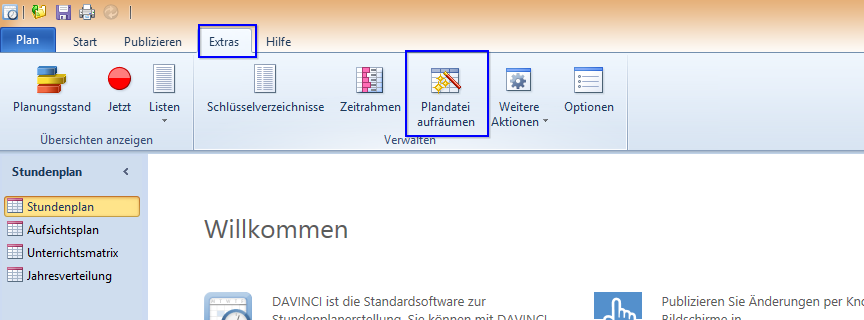

# Plandatei aufräumen

Unter "Extras" findet man den Aufruf ``Plandatei aufräumen``. Diese Option behebt die meisten Fehler in DAVINCI 6, da er historisch mit dem Programm gewachsen ist.

Generell empfiehlt es sich diese Option auszuführen wenn:

* Datenzeiger die ins Nirwana zeigen, die werden auf Null gesetzt, weil sie sonst zu Fehleranzeigen führen.
* Es werden Konsistenzprüfungen und ggf. Korrekturen durchgeführt, z.B. Startdatum muss immer kleiner/gleich Enddatum sein.
* Es werden unsinnige Daten gelöscht,. z.B. Veranstaltungen die keine Klasse/Lehrer/Raum/Fach enthalten.
* Es werden doppelte Änderungselemente gelöscht, die durch Fehler entstanden sind.
* Es werden durch Fehler entstandene Inkonsistenzen, z.B. fehlende Attribute (z.B. Attribut „Änderung fällt aus" setzen, weil Entfallgrund zwar vorhanden ist, aber dieser zwingend zugehörige Attributwert  nicht gesetzt ist, ergänzt soweit möglich, um einen konsistenten Zustand zu erreichen. 

