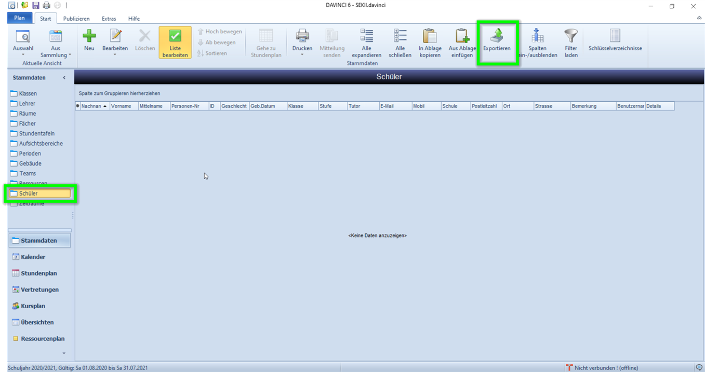
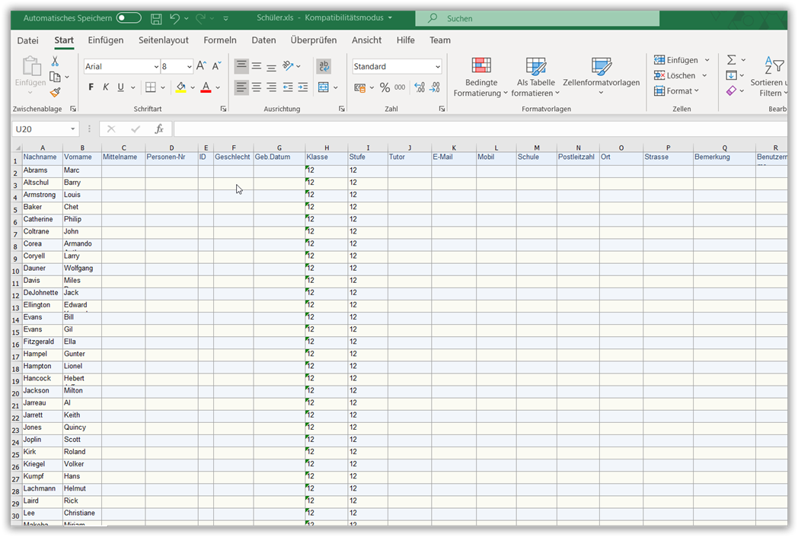
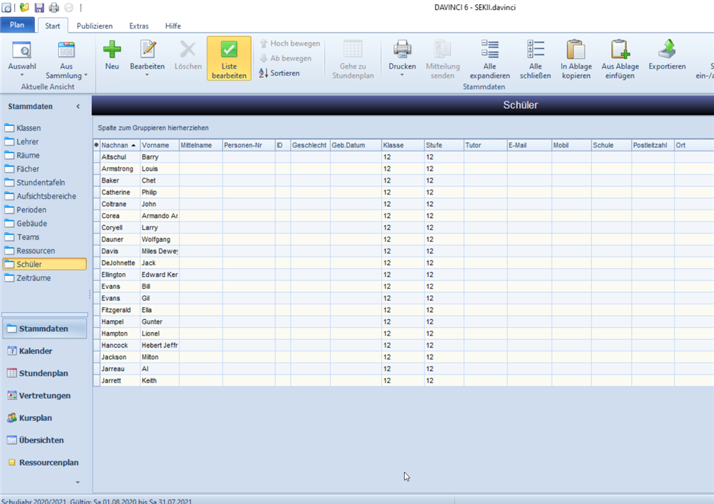

# Stammdaten von Schülern importieren

Sie können in DAVINCI Daten aus der Zwischenablage einfügen.

Die Einträge aus der Zwischenablage können z.B. aus Microsoft Excel oder Microsoft Word stammen.

> #### warning::Wichtig
>
> Beim Kopieren aus der Windows-Zwischenablage müssen Sie darauf achten, dass die Spaltentitel in der Benennung und Reihenfolge die gleiche ist, wie in der DAVINCI Tabelle, in die Sie kopieren! Es können nur textbasierte Zellen kopiert werden, also z.B. keine Symbole, Farben, Optionsfelder usw. So können Sie z.B. vorab den Tabellenkopf für die Schülerliste aus DAVINCI Stammdaten > Schüler exportieren.

So importieren Sie Schülerdaten aus Excel:

1. Öffnen Sie zunächst Ihr Stammdatenfenster "Schüler" - die Reihenfolge der Spalten ist entscheidend für den Aufbau Ihrer Excellisten
2. Öffnen Sie Ihre Excel-Liste mit Ihren Schülern, Sortieren Sie Ihre Spalten mit Inhalten gemäß der Stammdatenliste in DAVINCI

3. Die Mindeseingaben sind die Spalten Vor- und Nachname und Klasse. Im Feld Klasse muss exakt das Klassenkürzel einre Klasse aus den DAVINCI Stammdaten eingegeben werden.
4. Markieren Sie nun die Schüler in Excel ohne die Spaltenüberschriften.
5. Kopieren Sie die markieren Felder durch strg+c oder einen ``Rechtsklick > Kopieren``
6. Öffnen Sie das Stammdatenfenster "Schüler" in DAVINCI
5. Wählen Sie nun unter ``Start > Aus Zwischenablage einfügen``
7. Die kopierten Daten werden nun in der Stammdatenliste Schüler hinzugefügt.

