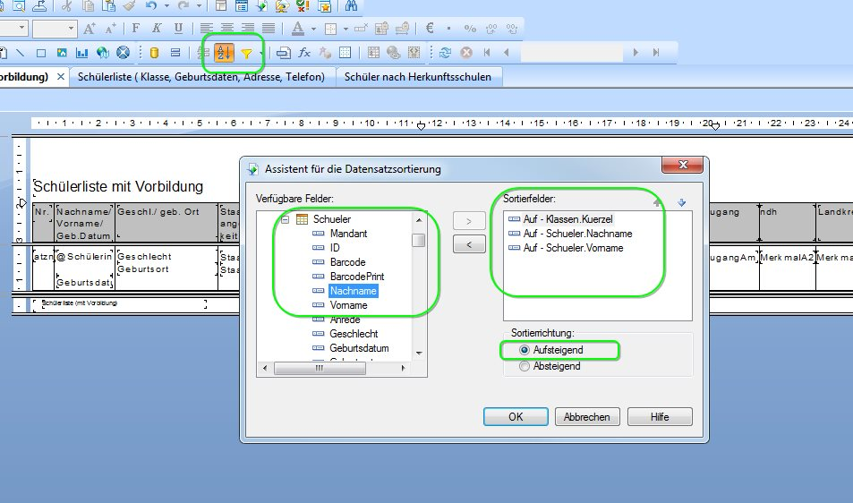
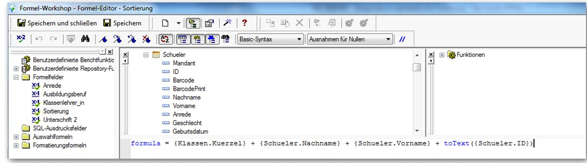
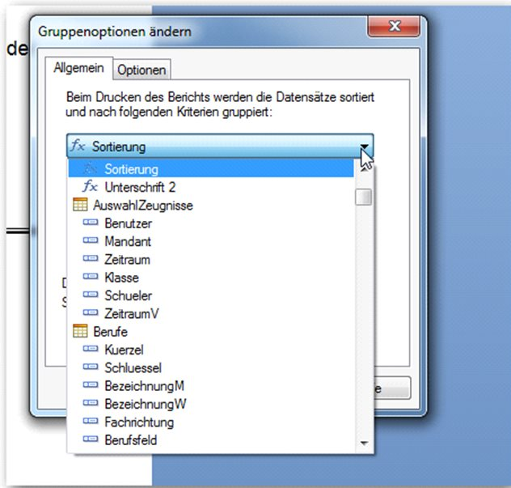

# Sortierung oder Gruppierung im Bericht

Wichtiger Unterschied:

Geht es nur um die Sortierung oder um eine Gruppierung?

Eine Gruppierung wäre beispielsweise die Darstellung der Schüler (alphabethisch = Sortierung) innerhalb (Gruppierung) einer Klasse.

## Sortierung am Beispiel einer Schülerliste

## Drucksortierung nach Klasse > Nachname > Vorname

Problem:

Der Bericht gibt die Schüler nicht in alphabethischer Reihenfolge aus, sondern aufsteigend nach der SchuelerID.

Grund ist die verkehrte Gruppierung des Berichtes, die Gruppierung sollte durch die Formel ersetzt werden:

`Feldexplorer > Rechtsklick > Neu > Benennung „Sortierung" > Fügen Sie die nachstehende Formel ein > Speichern und Schließen`:

Kopiervorlage: formula = {Klassen.Kuerzel} + {Schueler.Nachname} + {Schueler.Vorname} + toText({Schueler.ID})

Ändern Sie die Gruppierung von SchülerID auf Ihre selbstangelegte Formel "Sortierung" (Rechtsklick auf den Gruppenkopf an der rechten Seite: `Gruppe wechseln > Sortierung wählen > OK`) Fertig!
