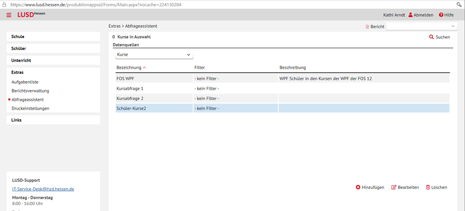
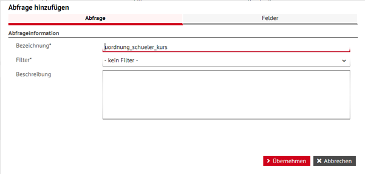
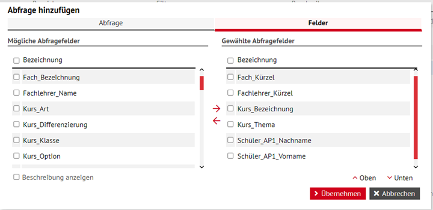
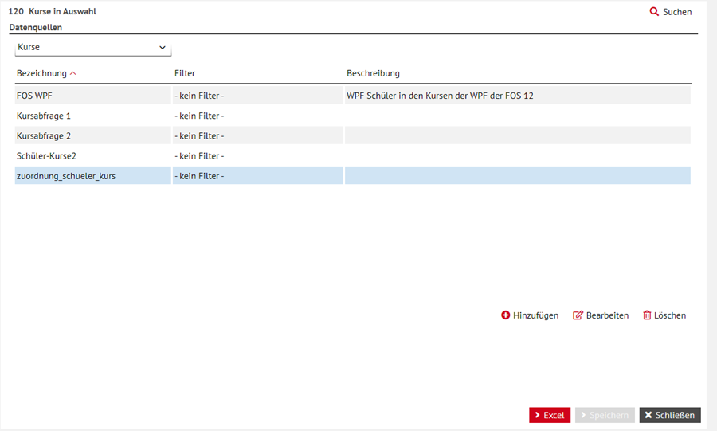

# LUSD exportieren für Enbrea

1. Rufen Sie den `Abfrageassistent` auf!

 

1. Wählen Sie `Datenquelle > Kurse` aus! Klicken Sie auf `Hinzufügen` und vergeben Sie einen Namen für Ihre Abfrage.

 
 
2. Fügen Sie Felder für Ihre Abfrage hinzu.
 
 

3. Über die Lupe oben rechts im Fenster können Sie alle Schüler der Abfrage hinzufügen (`Auswählen > gewünschte Schulformen > Alle Übernehmen`)
6. Klicken Sie unten rechts im Fenster auf `Excel` um den Report aufzurufen.
 
 