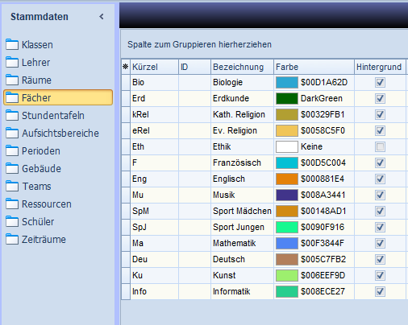
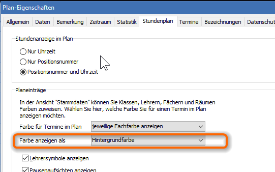

# Farben in der App und in der WEBBOX

In den beiden Modulen können die Fachfarben aus DAVINCI gezeigt werden.

Zwei Vorrausetzungen:

1. Unter `Stammdaten > Fächer` wurden die gewünschten Fachfarben gewählt.
2. Unter `Plan > Eigenschaften > tundenplan > Farbe anzeigen als`

