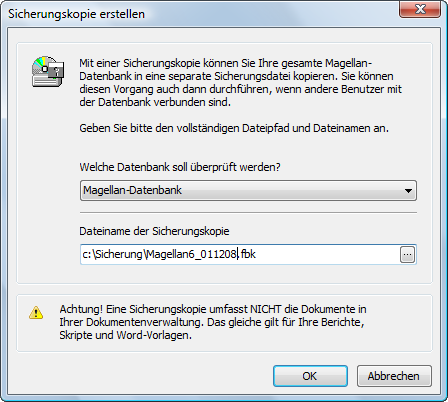

# Datensicherungen erstellen

Im MAGELLAN-Administrator kommen Sie unter dem Punkt „Datensicherung“ zu den Datensicherungsmöglichkeiten für Ihre Datenbank.

## Sicherungskopie erstellen

Klicken Sie auf dem Serverrechner auf Sicherungskopie erstellen, um eine Sicherung der MAGELLAN-Datenbank durchführen zu können. Im Fenster „Sicherungskopie erstellen“ müssen Sie zunächst im Auswahlfeld "Welche Datenbank soll überprüft werden?" einstellen, ob die MAGELLAN-Datenbank oder das MAGELLAN-Datawarehouse gesichert werden soll. „Sicherungskopie erstellen“ bezieht sich jeweils auf die Datenbank, an der Sie sich angemeldet haben. 

Wenn Sie die gewünschte Datenbank ausgewählt haben, klicken Sie bitte im Feld Dateiname der Sicherungskopie auf das kleine Lupensymbol. Es wird daraufhin ein Explorer geöffnet, in dem Sie den Speicherort der zu erstellenden Sicherungskopie auswählen können. 


 
> #### danger::Wichtig
> Da die Sicherung der Datenbank immer auf dem Serverrechner abgelegt wird, habe Sie von einem Client  nicht die Möglichkeit, durch Anklicken des Lupensymbols den Pfad auszusuchen. Sie können lediglich manuell den entsprechenden Pfad für den Serverrechner eintragen. Auch müssen Sie die Endung „.fbk“ an den Dateinamen anfügen. Wenn keinen Speicherort und keinen Dateityp angeben wird die Sicherungskopie ohne Dateiendung im Verzeichnis System32 abgelegt.

Bei Dateiname geben Sie bitte eine Bezeichnung und einen Pfad Ihrer Wahl für diese Datei an, also beispielsweise `C:\Sicherung\Magellan7_011208.fbk`. 

Wählen Sie im Feld Dateityp aus „Sicherungskopien (\*.fbk)“. Somit wird automatisch beim Speichervorgang diese Endung ergänzt. In unserem Beispiel würde somit an einem von Ihnen gewählten Speicherort eine Datei angelegt mit dem Namen `Magellan7_011208.fbk`.
 
Eine Sicherungskopie kann im laufenden Betrieb von MAGELLAN durchgeführt werden.

> #### danger::Wichtig
> Von der Sicherungskopie sind alle Dokumente, Word-Vorlagen und Berichte ausgenommen.

## Sicherungskopie wiederherstellen

Um eine bestehende Sicherungskopie wiederherstellen zu können, müssen Sie `Sicherungskopie wiederherstellen` wählen. Im Auswahlfeld Dateiname der Sicherungskopie kann man nun über das Lupensymbol den Explorer öffnen und hier die gewünschte Sicherungskopie (siehe „Sicherungskopie erstellen“) auswählen. Diese Sicherungskopie muss lokal auf dem Rechner liegen, an dem Sie den Rücksicherungsvorgang durchführen möchten. Der Vorgang gelingt nicht, wenn die Sicherungskopie in einem Netzwerkpfad abgespeichert wurde. 

Im Feld „Dateiname der neuen Datenbank“ kann man nun über das Lupensymbol den Explorer öffnen und einen Speicherplatz bestimmen sowie einen Namen für die wiederherzustellende Datenbank vergeben, also beispielsweise „Magellan“. Bitte achten Sie darauf, dass Sie bei Dateityp auswählen „Datenbankdateien (\*.fdb)“. Somit wird automatisch beim Speichervorgang diese Endung ergänzt. In unserem Beispiel würde an einem von Ihnen gewählten Speicherort eine Datei angelegt mit dem Namen Magellan6.fdb. Wenn Sie die wiederherzustellende Datei so benennen wie die aktive Datenbank, also in der Regel Magellan6.fdb, dann können Sie als Speicherort nicht den Datenbankordner wählen, da hier ja bereits eine Datei namens Magellan6.fdb existiert. Ein Ersetzen dieser bereits vorhandenen Datenbank durch die gleichnamige Wiederherstellungskopie wird an dieser Stelle verhindert, da sie ja im Rahmen der Sicherungsaktion in diesem Moment im Zugriff ist.

> #### info::Hinweis
> Das Herstellen einer Sicherungskopie und anschließende Wiederherstellen dieser Sicherungskopie hat eine reparierende und zugleich komprimierende Funktion. Die wiederhergestellte Sicherungskopie ist stets kleiner als die Ausgangsdatenbank, da Lücken in der Datenbank beseitigt werden und so die Datenmenge „abgespeckt“ wird. Wir empfehlen in Abständen die Realdatenbank mit einer wiederhergestellten Sicherung zu ersetzen. Bitte beachten Sie, dass beim Austausch der Datenbank immer der Firebird-Server gestoppt ist. Diesen Dienst können Sie stoppen und starten in der Systemsteuerung Ihres Servers im Aufruf Firebird Server Manager.

## Einbinden der Sicherung in den Windows Taskplaner

Sie können die Aktion "Datenbanksicherungskopie erstellen" mit in den Taskplaner des Serverrechners einbinden. Damit könnten Sie sicherstellen, dass diese Aktion automatisch einmal täglich ausgeführt wird. Gehen Sie dafür bitte folgendermaßen vor:

Erstellen Sie mit dem Texteditor eine neue Datei und kopieren den nachfolgenden Text hinein. 

> #### warning::Wichtig!
>
> Bitte beachten Sie, dass die Pfade bei Ihrer Installation abweichen können!


````
"C:\Program Files (x86)\Firebird\Firebird_2_5\bin\gbak.exe" -v -t -user SYSDBA -password masterkey -y 

"C:\Users\Public\Documents\Stueber Systems\Magellan 7\Datenbank\Backup\MAGELLAN7_%date:~0%.log"  

"C:\Users\Public\Documents\Stueber Systems\Magellan 7\Datenbank\MAGELLAN7.FDB" 

"C:\Users\Public\Documents\Stueber Systems\Magellan 7\Datenbank\Backup\MAGELLAN7_%date:~0%.FBK" pause
````

Speichern Sie diesen Text und passen die drei Pfade den Gegebenheiten auf Ihrem Serverrechner an. Wir beschreiben nachstehend die Bedeutung der einzelnen Punkte:


| Hinweis                        | Bedeutung                                |
|--------------------------------|------------------------------------------|
| Pfad zur gbak.exe              | Der erste Pfad führt zur gbak.exe, die die Datensicherung Ihrer Magellan6.fdb erstellt. Der von uns angebebene Pfad entspricht dem Standardinstallationspfad, könnte bei Ihnen aber abweichen. |
| -user und -password            | Anschließend ist die Administratorenanmeldung an Ihrer Datenbank in der Datei enthalten, wenn Sie ein anderes Passwort verwenden, tragen Sie dieses anstelle von „masterkey“ein. |
| -y und Pfad                    | Dieser optionale Pfad legt Ihnen pro Sicherung eine Logdatei mit dem Tagesdatum mit den Meldungen an. |
| Pfad und Dateiname der *.fdb   | Der nachfolgende Pfad verweist auf Ihre Datenbank. Liegt Ihre Datenbank an anderer Stelle, passen Sie diesen Pfad bitte an. |
| Ablagepfad der Sicherungskopie | Als letzte Information wird der Ablagepfad für die Sicherungskopie mit angegeben. Sie könnten sich einen gesonderten Unterordner "Backup" erstellen, müssten auf diesen dann im Pfad verweisen. |
| Pfad und Dateiname der *.fbk   | Der Dateiname wird automatisch mit Magellan6_aktuelles Datum.fbk angegeben. Durch das Datum im Namen wird sichergestellt, dass die Sicherungskopie des Vortages nicht täglich überschrieben wird. |
| pause                          | Programmfenster im Vordergrund oder unsichtbar: Wenn Sie "pause" weglassen, dann läuft die Sicherung im Hintergrund ab, mit pause können Sie den Fortschritt im Vordergrund verfolgen. Wenn Sie eine Logdatei erstellen lassen, können Sie auf diesen Parameter verzichten. |


Wenn alle Angaben angepasst sind, speichern Sie die Datei und benennen sie anschließend in "MagellanBackup.bat"um. Legen Sie diese Datei bitte auf Ihrem Server im Datenbankordner ab.

> #### danger::Achtung!
>
>  Führen Sie die Datei zum Test bitte per `Doppelklick` oder `Rechtsklick > Ausführen` aus.

Hat es funktioniert? Dann richten Sie im Taskplaner bitte einen neuen Task ein, der täglich zu einer bestimmten Zeit diese Datei ausführt. Gehen Sie dazu auf dem Server unter `Start > Programme > Zubehör > Systemprogramme > Geplante Tasks`.


