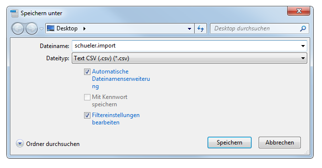
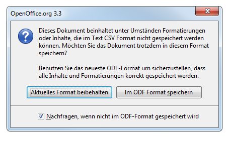
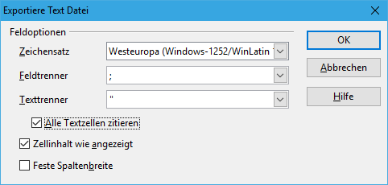

# CSV-Dateien mit Texttrennzeichen speichern

Daten, die Sie als Excelliste o.ä. vorliegen haben, sind je nach Inhalt, in die MAGELLAN-Datenbank importierbar. Sie finden dazu im MAGELLAN-ADMINISTRATOR den Punkt `Datenimporte > Daten über MAGELLAN-Importformat importieren`. Welcher Dateiaufbau notwendig ist und welche Felder in welchem Format erwartet werden, beschreiben wir in der Dokumentation [MAGELLAN Import](https://doc.magellan6-import.stueber.de/) im Abschnitt [MAGELLAN Importformat](https://doc.magellan-import.stueber.de/MagImp/magellan-importformat.html).

Texte müssen für den korrekten Import in Anführungszeichen stehen, bei einigen Tabellenkalkulationsprogrammen kann es dabei zu Problemen kommen. Wir beschreiben nachstehend die Speicherung mit OpenOffice.

## Speichern mit OpenOffice

Aus OpenOffice gehen Sie auf `Datei > Speichern unter > Dateityp CSV` und setzen den Haken für `Filtereinstellungen bearbeiten`.

Klicken Sie auf `Speichern`! Sollte die Nachfrage erscheinen, ob das Format beibehalten werden soll, bestätigen Sie es bitte.

Anschließend erscheint folgendes Fenster, hier stellen Sie Folgendes ein:
* als `Feldtrenner` Semikolon ein
* als `Texttrenner` Anführungszeichen
* haken bitte `alle Textzellen zitieren` an

Bestätigen mit OK. Fertig!

## Dateiformat umstellen

Wenn das Zeichenformat der Datei ändern müssen, gehen Sie bitte wie folgt vor:
1. Öffnen Sie dazu den Editor der automatisch bei jeder Windows Installation mitinstalliert wird. 
2. Öffnen Sie die betroffene CSV Datei im Editor und klicken Sie auf Datei -> Speichern unter.
3. Wählen Sie z.B. die Codierung ANSI und speichern Sie die Datei ab.
