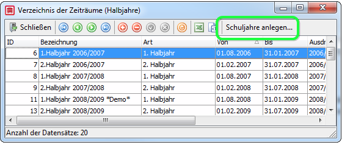

# ABS: Neues Halbjahr, neues Schuljahr – Was ist zu tun

**Wir beschreiben das Vorgehen für Allgemeinbildende Schulen:**
Jede Ihrer Klassen existiert nur zwei Halbjahre lang und anschließend wird eine neue, durchaus gleichnamige, Klasse angelegt. Der Zeitpunkt an dem Sie diese Schritte ausführen kann frei gewählt werden, Sie können beispielsweise das neue Schuljahr am Ende des zweiten Halbjahres vorbereiten ohne dass zum Beispiel der Zeugnisdruck beeinflusst wird.

## Schuljahresanfang

### Zeitraum

Bitte legen Sie unter `Verzeichnisse > Zeiträume` ein neues Schuljahr an. Dazu verwenden Sie die Schaltfläche `Schuljahre anlegen`.

### Klassen

Alle Klassen, die es im neuen Schuljahr gibt, werden neu angelegt. Das erledigen Sie entweder in dem Sie in das neue 1. Halbjahr wechseln und dort im Klassenmenü über das rote Plus die Klassen neu anlegen. 

Oder besser: Sie wechseln ins neue Halbjahr, und wählen `Laufbahnprozess > Klassen übernehmen`. Dieser Assistent ermöglicht Ihnen auf der Basis Ihrer alten Klassen Kopien ins neue Halbjahr erstellen zu können. Die Kürzel bleiben wie sie sind, Sie nutzen den Assistent lediglich um nicht von Hand neue Klassen anlegen zu müssen.

#### Assistent "Schuljahreswechsel" erstellt neue Klassen

Um auf der Basis der bereits im  alten Halbjahr existierenden Klassen neue Klassen für das neue Schuljahr erzeugen zu können, bieten wir Ihnen einen Assistenten mit an.

Dieser Assistent kopiert Klassen mit allen getroffenen Einstellungen (aber ohne Schüler!)  und legt sie dort als neue Klassen mit einer neuen ID an. Eine ausführliche Anleitung finden Sie unter: [Assistent "Klassen übernehmen" erstellt neue Klassen](https://doc.magellan7.stueber.de/schulverwaltung/howto/schuljahreswechsel/#assistent-klassen-ubernehmen-erstellt-neue-klassen)

!!! tip "Tipp"

    Wir empfehlen zum Anlegen von Klassen fürs neue Schuljahr diesen Assistenten zu verwenden, Sie können so gut sicherstellen, dass immer alle relevanten Einstellungen (zum Beispiel die Klassenfachtafel, die Klassenart, der Jahrgang usw.) für die Klassen vergeben wurden.

### Schüler

Führen Sie folgende Schritte durch. Gehen Sie in dieser Reihenfolge vor, damit Sie klassenweise versetzen können:

1. Abgänger werden über `Extras > Schüler ausschulen` ausgeschult.

2. Die neuen Schüler werden über `Extras > Schüler einschulen` eingeschult.

3. Bleibt jemand sitzen, wird er in die neu angelegt gleichnamige Klasse versetzt, also zum Beispiel aus der alten 5a in die neu angelegte 5a.

4. Ihre Bestandsschüler werden klassenweises mit `Extras > Schüler versetzen` aus dem alten Halbjahr in die neue höhere Klasse versetzt.

## Halbjahreswechsel

Es werden keine neuen Klassen benötigt.

1. Alle Schüler, die die Schule verlassen haben werden über `Extras > Schüler` ausschulen ausgeschult.

2. Alle weiteren Schüler werden mit `Extras > Schüler fortschreiben` fortgeschrieben. Sie müssen hierbei nicht klassenweise vorgehen, sondern markieren alle Schüler und schreiben sie fort.

!!! info "Hinweis"

    Wenn ein Schüler innerhalb eines Halbjahres die Klasse wechselt, wird das per `Extras > Schüler wechseln` durchgeführt. 

Die Gründe dafür können zum Beispiel sein:

* Der Schüler wechselt in eine Parallelklasse
*  Freiwilliger Rücktritt im Jahr
* Der Schüler wechselt seinen Bildungsgang (berufsbildender Bereich)
  
Versehentlich einer Klasse zugeordnete Schüler werden NICHT gewechselt, dafür gibt es für die jeweils als letztes in der Schülerlaufbahn durchgeführte Aktion die Möglichkeit "Schüler korrigieren". Wird in diesem Assistenten ein Schüler nicht angezeigt, hat seine letzte Laufbahnaktion nicht in diesem Halbjahr stattgefunden.
