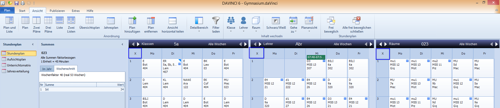
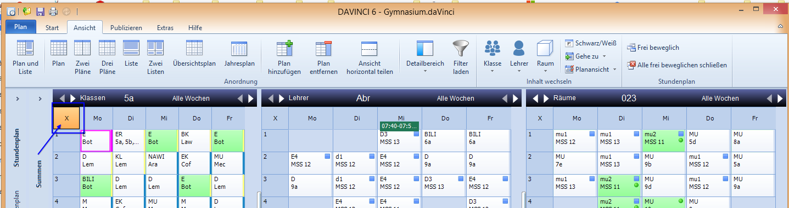

# Korrespondierende Pläne

Damit im Bereich STUNDENPLAN die Pläne und Listen miteinander korrespondieren, achten Sie bitte darauf, dass in den jeweiligen Planfenstern das Kreuzchen oben links wie folgt angezeigt werden:

Durch einen Klick auf das Kreuzchen oben links können Sie Pläne aus der Korrespondenz herausnehmen. Im Planfenster ist dann das Kreuz orange hinterlegt:

