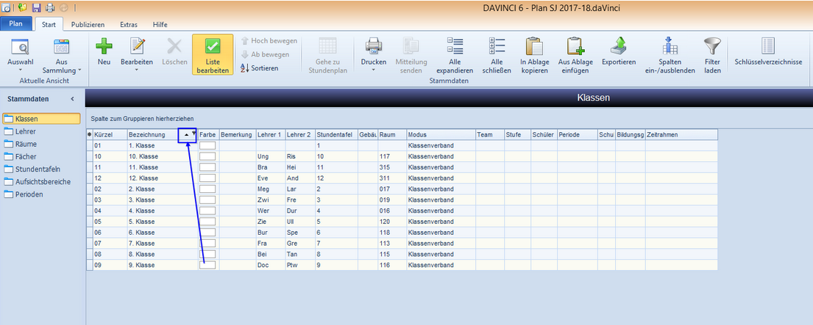

# Sortierung im Stammdatenfenster

!!! info "Hinweis"

    In den Stammdatenfenstern gibt es zwei Möglichkeiten Inhalte zu sortieren: eine Sortierung für den Moment innerhalb der gewählten Ansicht und eine feste Sortierung, die sich auch auf weitere Bereiche auswirkt (den Ausdruck, die Anzeige in anderen Listen, die Sortierung in der DAVINCI App oder in unserer DAVINCI Webbox). 

Sie können eine gesamte Liste nach einzelnen oder mehreren Spalten sortieren. Sortiert wird alphanummerisch, also nach Buchstaben und/oder Zahlen auf- und absteigend. Um eine Liste nach einer einzelnen Spalte zu sortieren, klicken Sie mit der linken Maustaste auf den Kopf der Spalte, nach der sortiert werden soll. 
Der erscheinende Pfeil im Spaltenkopf zeigt Ihnen an, nach welcher Spalte sortiert wird und ob die Werte auf- oder absteigend sortiert werden.

Halten Sie die Strg-Taste gedrückt und klicken Sie erneut auf den Spaltenkopf um die Sortierung aufzuheben. Die Liste wird nun wieder nach Ihrer in der Datei gespeicherten
Reihenfolge angezeigt. 

!!! info "Hinweis"

    Für eine dauerhafte Sortierung, die in der Datei gespeichert und auch anderen Benutzern bzw. in anderen Modulen angezeigt wird, erreichen Sie mit Hilfe des Befehls ``Start > Sortieren``. Ihnen werden somit Lehrer-, Klassen- und Raumpläne in dieser Sortierung angezeigt.

