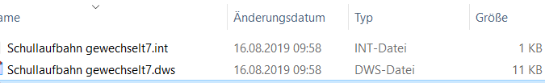

# Korrekturen per Skript (MAGELLAN 7)

Es gibt für verschiedene Situationen Skripte, die Sie zur Korrektur innerhalb Ihrer Datenbank mit Hilfe des MAGELLAN-Skript-Editor ausführen können. Sie erhalten in diesem Fall einen Link zu einem Downloadpaket von unserem Support-Team.
Laden Sie bitte das Paket über den Link herunter und führen dann bitte die nachfolgenden Schritte aus.

!!! danger "Achtung"

    Diese Anleitung ist eine allgemeine Beschreibung der nötigen Schritte, es kann sein, dass die Skriptdatieen in den Abbildungen abweichend benannt sind, dennoch sind die Schritte gültig und letztlich nur die Datenendungen verbindlich.

1. Laden Sie das Paket über den von unserem Supportteam in Ihrem Ticket übermittelten Link herunter.
2. Entpacken Sie das Zippaket über `Rechtsklick > Extrahieren` und öffnen anschließend das Verzeichnis. Im Verzeichnis ist eine Datei mit der Endung `*.dws`, eine Datei mit der Endung `*.int`und eine Datei mit dem Namen `MagSkriptEditor.exe`.



3. Starten Sie bitte per Doppelklick den MAGELLAN Skripteditor per Doppelklick auf die Datei "MagScriptEditor.exe".
4. Im Programmfenster gehen Sie bitte auf `Öffnen`!


5. Wählen Sie bitte wie nachfolgend die Datei mit der Endung `*.dws` aus und klicken anschließend auf `Öffnen`!


6. Klicken Sie in das Fensterchen in dem das Wort `Quellcode` steht und schalten bitte in der Liste auf `Interface-Emulation` um.


7. Als nächstes brauchen Sie den Pfad zur Datenbank und ggfs. den Servernamen. Starten Sie dazu parallel  den MAGELLAN Administrator. Im Anmeldefenster melden Sie sich als sysdba an oder wählen falls Sie diese Zugangsdaten nicht parat haben, einfach `<keine Anmeldung>` aus.


8.  Rufen Sie den Punkt `Datenbankverbindungen` auf und klicken bitte doppelt auf Ihre auf der rechten Seite angegebene Verbindung. Es öffnet sich das Fenster der Verbindungsdetails, Sie wählen die Unterkarte `Datenordner`.

9. Sie benötigen den Eintrag aus dem Feld `Server` und den Eintrag aus dem Feld `Dateipfad aus dem Server`. Übernehmen Sie die Daten und tragen es plus dem sysdba-Passwort bitte im Skripteditor wieder ein.


Nachstehend eingetragene Beispieldaten: 

Vorlage|eingetragene Beispieldaten
--|--
const MagellanDatabase = 'Eintrag aus Dateipfad auf dem Server';|const MagellanDatabase = 'C:\Users\Public\Documents\Stueber Systems\Magellan 7\Datenbank\MAGELLAN7.fdb';
const MagellanUserName = 'sysdba';|const MagellanUserName = 'sysdba';
const MagellanPassword = 'Ihr Passwort';|const MagellanPassword = 'masterkey';
const Server = 'Eintrag aus dem Feld Server';|const Server = 'localhost';<br/>oder, wenn das Skript nicht auf dem Serverrechner ausgeführt wird beispielsweise: <br/>const Server = 'Verwaltungsserver';
const Protocol = 'TCP/IP';|const Protocol = 'TCP/IP';

10. Sie lösen das Skript über das grüne Dreieck aus, das Skript überprüft die Schüler und meldet abschließend `Vorgang erfolgreich abgeschlossen`. Schließen Sie den Skripteditor, speichern ggfs. Ihre Angabe, schließen Sie den MAGELLAN Administrator und überprüfen in MAGELLAN das Ergebnis.


## Probleme

### Unable to complete network request...

````
Originaldateiname: Schullaufbahn gewechselt7.dws
Letzte Änderung: 05.09.2019
Copyright (c) 2019 STÜBER SYSTEMS GmbH
-------------------------------------------------------------------------------
Verbindung zu Datenbank aufbauen...
[FireDAC][Phys][FB]Unable to complete network request to host "IhrServername".
Failed to establish a connection.
[FireDAC][Comp][Clnt]-512. Verbindung ist nicht für [] festgelegt. Mögliche Ursache: Die Eigenschaftswerte von Connection und ConnectionName sind beide leer
Verbindung zur Datenbank abbauen...OK!
*** Vorgang mit Fehlern abgeschlossen ***
````

Sollte diese Meldung gezeigt werden, kann es ein Problem innerhalb Ihres Netzwerkes geben. Sie könnten statt des Servernamens die IP-Adresse des Serverrechners eintragen oder auch das Skript direkt auf dem Serverrechner ausführen und als Server dann `localhost` eintragen.